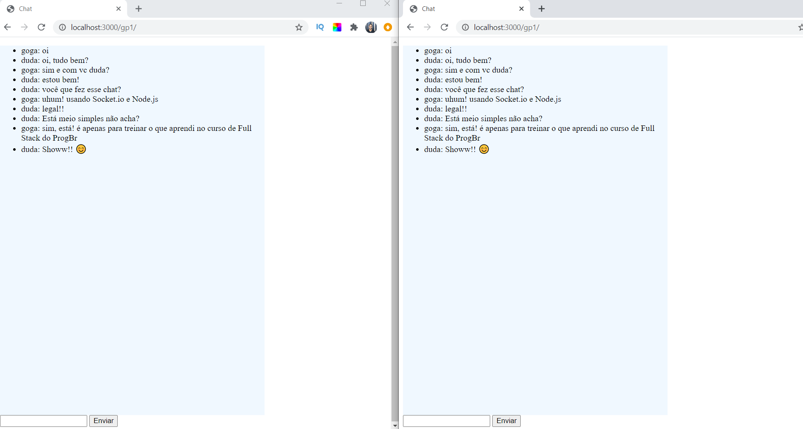

# Chat com Socket.io

Projeto de um Chat com 2 salas de conversa utilizando Socket.io

Feito apenas para treinar o novos conhecimentos de Socket.

As salas foram desenvolvidas para que apenas 4 usuários tenham cores diferentes na conversa. Facilmente mudado no 'style.css'.

